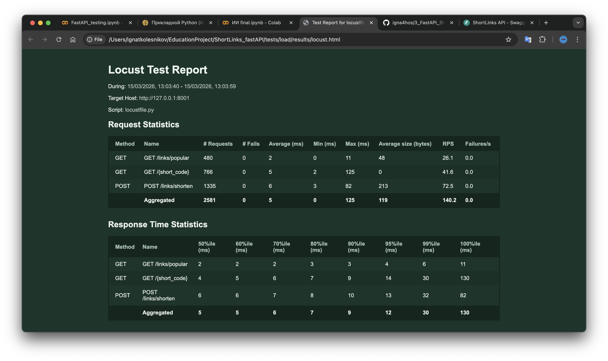

# 3 проект - Fast API. Колесников Игнат Евгеньевич

API-сервис для сокращения ссылок на FastAPI. Приложение можно попробовать самому по ссылке [ссылке](https://three-fastapi-shortlinks.onrender.com/docs).

Сервис позволяет:

- регистрировать и авторизовывать пользователей;
- создавать короткие ссылки;
- задавать время жизни ссылки;
- задавать лимит переходов;
- редактировать и удалять свои ссылки;
- получать статистику по ссылке;
- искать ссылки по оригинальному URL;
- смотреть историю удалённых/просроченных ссылок;
- получать список популярных ссылок;
- выполнять редирект по короткому коду.

### Стек

- FastAPI
- PostgreSQL
- SQLAlchemy Async
- Redis
- JWT-аутентификация


## Описание API
### 1. Регистрация
POST /auth/register

Создаёт нового пользователя.

Тело запроса
```
{
  "email": "user@example.com",
  "password": "stringst"
}
```
Ответ
```
{
  "id": 1,
  "email": "user@example.com",
  "created_at": "2026-03-09T12:00:00Z"
}
```

### 2. Авторизация

POST /auth/login

Проверяет email и пароль и возвращает JWT access token.

Тело запроса
```
{
  "email": "user@example.com",
  "password": "string"
}
```
Ответ
```
{
  "access_token": "string",
  "token_type": "bearer"
}
```

### 3. Создание короткой ссылки

POST /links/shorten

Создаёт короткую ссылку.

Поддерживает:

- кастомный alias через custom_alias;
- срок жизни через expires_at;
- лимит переходов через click_limit. Если ничего не передавать в теле запроса, то не будет ограничений на количество переходов по ссылке.

Если пользователь авторизован, ссылка будет привязана к его аккаунту.

Тело запроса
```
{
  "original_url": "https://example.com/",
  "custom_alias": "string",
  "expires_at": "2026-03-09T20:08:12.132Z",
  "click_limit": 1
}
```
Ответ
```
{
  "short_code": "string",
  "short_url": "string",
  "original_url": "string",
  "created_at": "2026-03-09T20:08:30.874Z",
  "expires_at": "2026-03-09T20:08:30.874Z",
  "click_limit": 0
}
```

Пример реального ответа
```
{
  "short_code": "peaky",
  "short_url": "https://three-fastapi-shortlinks.onrender.com/peaky",
  "original_url": "https://www.kinopoisk.ru/film/5461947/?utm_referrer=organic.kinopoisk.ru",
  "created_at": "2026-03-09T20:49:44.884592Z",
  "expires_at": "2026-06-20T20:12:00Z",
  "click_limit": 1000
}
```
Когда мы переходим по ссылке с поля [short_url](https://three-fastapi-shortlinks.onrender.com/peaky), то переходим на оригинальный сайт

### 4. Поиск ссылки по оригинальному URL

GET /links/search?original_url={url}

Возвращает список активных ссылок, созданных для указанного оригинального URL

### 5. Получение статистики по ссылке

GET /links/{short_code}/stats

Возвращает статистику по активной ссылке:

- short code;
- оригинальный URL;
- дату создания;
- количество переходов;
- дату последнего использования;
- дату истечения;
- лимит переходов;
- признак того, что ссылка была создана авторизованным пользователем.

### 6. Обновление ссылки

PUT /links/{short_code}

Доступно только авторизованному пользователю и только для своих ссылок.
Можно изменить:

- original_url
- expires_at
- click_limit

### 7. Удаление ссылки

DELETE /links/{short_code}

Доступно только авторизованному пользователю и только для своих ссылок.

## Дополнительный функционал

### 8. История удалённых и истёкших ссылок

GET /links/expired/history

Возвращает список архивных записей из таблицы expired_links с указанием причины удаления.

Реальный пример ответа
```
[
  {
    "short_code": "original",
    "original_url": "https://inoriginal.net/films/page/4/",
    "created_at": "2026-03-09T19:30:02.411139Z",
    "expired_at": "2026-03-09T19:30:58.152652Z",
    "last_used_at": "2026-03-09T19:30:27.777516Z",
    "click_count": 5,
    "click_limit": null,
    "expiration_reason": "manual_delete"
  },
  {
    "short_code": "openplease",
    "original_url": "https://www.youtube.com/watch?v=dQw4w9WgXcQ&list=RDdQw4w9WgXcQ&start_radio=1",
    "created_at": "2026-03-09T19:21:26.962362Z",
    "expired_at": "2026-03-09T19:21:54.499346Z",
    "last_used_at": "2026-03-09T19:21:54.499301Z",
    "click_count": 5,
    "click_limit": 5,
    "expiration_reason": "click_limit_reached"
  },
  {
    "short_code": "json",
    "original_url": "https://jsonformatter.org/json-parser",
    "created_at": "2026-03-09T19:13:22.862836Z",
    "expired_at": "2026-03-09T19:16:14.789321Z",
    "last_used_at": null,
    "click_count": 0,
    "click_limit": 25,
    "expiration_reason": "expired_at"
  }
]
```

### 9. Популярные ссылки

GET /links/popular

Возвращает список самых популярных ссылок и число переходов по ним.

Реальный пример ответа
```
[
  {
    "short_code": "comics",
    "total_clicks": 21
  },
  {
    "short_code": "back",
    "total_clicks": 5
  },
  {
    "short_code": "myproject",
    "total_clicks": 1
  }
]
```

### Дополнительный функционал, реализованный в других методах
- Создание коротких ссылок для незарегистрированных пользователей
- Ограничение на количество переходов по ссылке

## Описание таблиц

В проекте 3 таблицы:

- users
- short_links
- expired_links

### Таблица users
| Поле              | Тип                       | Ограничения          |
| ----------------- | ------------------------- | -------------------- |
| `id`              | `Integer`                 | `PRIMARY KEY`        |
| `email`           | `String(320)`             | `UNIQUE`, `NOT NULL` |
| `hashed_password` | `String(255)`             | `NOT NULL`           |
| `created_at`      | `DateTime(timezone=True)` | `NOT NULL`           |


Назначение

Хранит пользователей сервиса. Один пользователь может создать много коротких ссылок.

### Таблица short_links
| Поле                       | Тип                       | Ограничения                       |
| -------------------------- | ------------------------- | --------------------------------- |
| `id`                       | `Integer`                 | `PRIMARY KEY`                     |
| `short_code`               | `String(64)`              | `UNIQUE`, `NOT NULL`              |
| `original_url`             | `Text`                    | `NOT NULL`                        |
| `created_at`               | `DateTime(timezone=True)` | `NOT NULL`                        |
| `updated_at`               | `DateTime(timezone=True)` | `NOT NULL`                        |
| `expires_at`               | `DateTime(timezone=True)` | `NULL`                            |
| `last_used_at`             | `DateTime(timezone=True)` | `NULL`                            |
| `click_count`              | `Integer`                 | `NOT NULL`, `DEFAULT 0`           |
| `click_limit`              | `Integer`                 | `NULL`                            |
| `is_active`                | `Boolean`                 | `NOT NULL`, `DEFAULT true`        |
| `creator_user_id`          | `Integer`                 | `FOREIGN KEY -> users.id`, `NULL` |
| `created_by_authenticated` | `Boolean`                 | `NOT NULL`, `DEFAULT false`       |

Назначение

Основная таблица активных коротких ссылок.

### Таблица expired_links

| Поле                | Тип                       | Ограничения                       |
| ------------------- | ------------------------- | --------------------------------- |
| `id`                | `Integer`                 | `PRIMARY KEY`                     |
| `short_code`        | `String(64)`              | `NOT NULL`                        |
| `original_url`      | `Text`                    | `NOT NULL`                        |
| `created_at`        | `DateTime(timezone=True)` | `NOT NULL`                        |
| `expired_at`        | `DateTime(timezone=True)` | `NOT NULL`                        |
| `last_used_at`      | `DateTime(timezone=True)` | `NULL`                            |
| `click_count`       | `Integer`                 | `NOT NULL`, `DEFAULT 0`           |
| `click_limit`       | `Integer`                 | `NULL`                            |
| `creator_user_id`   | `Integer`                 | `FOREIGN KEY -> users.id`, `NULL` |
| `expiration_reason` | `String(64)`              | `NOT NULL`                        |

Назначение

Архив ссылок, которые были удалены по разным причинам.

### Запуск проекта

Приложение можно опробовать самому либо развернуть локально. В проекте есть docker-compose файл и конфигурационный файл, который откроет проект на 8000 порту при помощи команды
```
uvicorn app.main:app --reload
```
Сам же проект развёрнут при помощи сайта [render](https://three-fastapi-shortlinks.onrender.com/docs#/)

## Тестирование

Тесты находятся в папке `tests/` на одном уровне с `app/`.

### Что покрыто

- unit-тесты для `security`, `shortcode`, `cache`, `datetime_utils`, `cleanup_worker`, `link_lifecycle`, зависимостей и ключевых route-функций;
- функциональные API-тесты через `httpx.AsyncClient` и ASGI-приложение FastAPI;
- CRUD-сценарии для коротких ссылок, поиск, статистика, редиректы, популярные ссылки, история архивных ссылок;
- проверки невалидных данных, авторизации, владения ссылкой и сценариев с истечением срока жизни/лимита кликов;
- load-тест сценария массового создания ссылок и чтения популярных/редиректных маршрутов через Locust.

### Как запустить

Установка зависимостей:

```bash
pip install -r requirements-dev.txt
```

Запуск тестов:

```bash
pytest tests
```

Проверка покрытия:

```bash
coverage erase
coverage run -m pytest tests
coverage report
coverage html
```

### Текущее покрытие

- текущее покрытие приложения (`app/`): `98%`
- текстовый отчёт: `coverage-summary.txt`
- HTML-отчёт: `htmlcov/index.html`

| Name                              | Stmts | Miss | Cover | Missing        |
|-----------------------------------|------:|-----:|------:|----------------|
| app/api/deps.py                   | 29    | 0    | 100%  |                |
| app/api/routes/__init__.py        | 2     | 0    | 100%  |                |
| app/api/routes/auth.py            | 26    | 5    | 81%   | 20-24          |
| app/api/routes/links.py           | 151   | 3    | 98%   | 72, 120, 281   |
| app/core/config.py                | 29    | 0    | 100%  |                |
| app/core/security.py              | 22    | 0    | 100%  |                |
| app/db/base.py                    | 3     | 0    | 100%  |                |
| app/db/session.py                 | 8     | 0    | 100%  |                |
| app/main.py                       | 34    | 0    | 100%  |                |
| app/models/__init__.py            | 4     | 0    | 100%  |                |
| app/models/expired_link.py        | 18    | 0    | 100%  |                |
| app/models/link.py                | 21    | 0    | 100%  |                |
| app/models/user.py                | 11    | 0    | 100%  |                |
| app/schemas/auth.py               | 16    | 0    | 100%  |                |
| app/schemas/link.py               | 63    | 1    | 98%   | 23             |
| app/services/cache.py             | 49    | 0    | 100%  |                |
| app/services/cleanup_worker.py    | 27    | 0    | 100%  |                |
| app/services/datetime_utils.py    | 12    | 0    | 100%  |                |
| app/services/link_lifecycle.py    | 62    | 0    | 100%  |                |
| app/services/shortcode.py         | 5     | 0    | 100%  |                |
| **TOTAL**                         | **592** | **9** | **98%** |                |



### Нагрузочное тестрование

Локальный сервер для нагрузочного теста:

```bash
uvicorn tests.load.load_app:app --host 127.0.0.1 --port 8001
```

Запуск Locust в headless-режиме:

```bash
locust -f tests/load/locustfile.py --headless -u 20 -r 5 -t 20s --host http://127.0.0.1:8001 --csv=tests/load/results/locust --html=tests/load/results/locust.html
```

### Результаты последнего прогона Locust

- суммарно обработано `2522` запросов, ошибок `0`
- агрегированное среднее время ответа: `5.79 ms`, median: `5 ms`, p95: `12 ms`, p99: `30 ms`
- `POST /links/shorten`: `1313` запросов, avg `6.98 ms`, p95 `13 ms`
- `GET /{short_code}`: `740` запросов, avg `6.05 ms`, p95 `14 ms`
- `GET /links/popular`: `469` запросов, avg `2.05 ms`, p95 `4 ms`

Файлики с результатами:

- HTML-отчёт Locust: `tests/load/results/locust.html`
- CSV-метрики: `tests/load/results/locust_stats.csv`
- сценарий нагрузки: `tests/load/locustfile.py`

Кэширование заметно помогает маршруту `GET /links/popular`: в смешанной нагрузке медиана держится на 2 ms, p95 на 4 ms, что ниже, чем у редиректа и создания ссылки.
